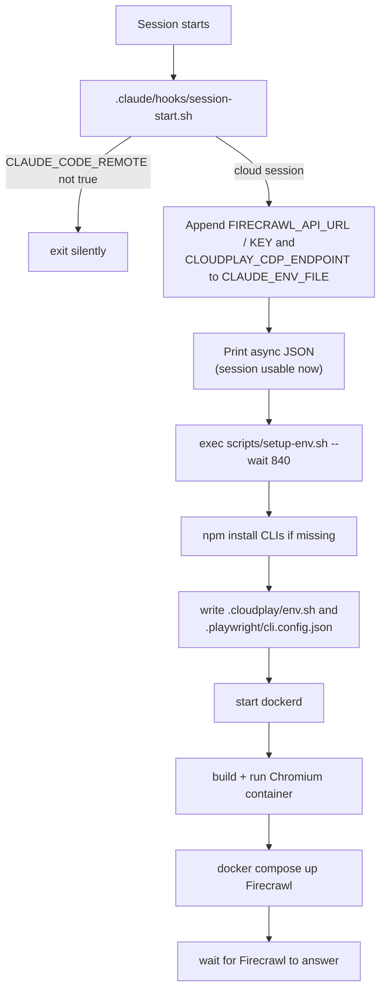

# CloudPlay

Give Claude Code on the web a working **self-hosted Firecrawl** and a working
**`playwright-cli`**, automatically, in every session.

Claude Code's cloud sandbox has Docker installed but not running, caps file
descriptors below what Firecrawl asks for, intercepts outbound TLS with two
different CAs, and breaks host-side Chromium's TLS handshake outright. This
repo packages the workarounds into a SessionStart hook so none of that is your
problem: open a session, and a few moments later `firecrawl` and
`playwright-cli` just work.

The reasoning behind each workaround lives in
[`docs/cloud-env-setup.md`](docs/cloud-env-setup.md).

Separately, the repo ships an optional pair of [session handoff
hooks](#session-handoffs-optional). They make every commit Claude creates carry a
short handoff doc, so work picks up cleanly after an autocompact.

## What you get

| Piece | Where it runs | Reached at |
| --- | --- | --- |
| Firecrawl API (plus Redis, RabbitMQ, Postgres, playwright-service) | Docker Compose | `http://localhost:3663` |
| Headless Chromium with the sandbox CAs trusted | Docker container | CDP on `http://localhost:9222` |
| `firecrawl` CLI (`firecrawl-cli`) | Host, npm global | points at the local API |
| `playwright-cli` (`@playwright/cli`) | Host, npm global | drives the container browser over CDP |
| Firecrawl and playwright-cli agent skills | `.claude/skills/` | loaded by Claude Code |

`search`, `scrape`, `map`, and `crawl` work with no API keys. Search falls back
to DuckDuckGo when no SearXNG endpoint is configured.

Both ports are bound to `127.0.0.1` only. Self-hosted Firecrawl runs with
authentication off (`USE_DB_AUTHENTICATION=false`), so exposing it more widely
would hand out an open scraping proxy.

## How it works



The hook does nothing unless `CLAUDE_CODE_REMOTE=true`. On a local machine it
exits immediately, so it never competes with a Firecrawl you already run
yourself.

In a cloud session it writes the connection settings into the session
environment first, then switches to async mode, so the session is usable
straight away while images pull in the background. The setup script is
idempotent: when everything is already up it finishes in milliseconds, and on a
cold container it pulls several GB of images the first time. The 840-second
deadline counts from when the script starts, which keeps it inside the hook's
900-second async timeout.

## Add it to your own project

1. **Copy these files** into your repo, keeping the paths:

   ```
   .claude/hooks/session-start.sh
   scripts/setup-env.sh
   docker/firecrawl/docker-compose.yml
   docker/firecrawl/docker-compose.proxy-ca.yml
   docker/chromium/Dockerfile
   config/playwright-cli.config.json
   docs/cloud-env-setup.md          # optional, but explains the why
   ```

   Make sure both scripts stay executable:

   ```bash
   chmod +x .claude/hooks/session-start.sh scripts/setup-env.sh
   ```

2. **Register the hook** in `.claude/settings.json`. If you already have one,
   merge this into your existing `hooks`:

   ```json
   {
     "hooks": {
       "SessionStart": [
         {
           "hooks": [
             {
               "type": "command",
               "command": "\"$CLAUDE_PROJECT_DIR\"/.claude/hooks/session-start.sh"
             }
           ]
         }
       ]
     }
   }
   ```

   The inner quotes keep the hook working when the project path contains
   spaces.

3. **Ignore generated state** by adding these lines to `.gitignore`:

   ```gitignore
   .cloudplay/
   .playwright/
   .playwright-cli/
   .firecrawl/
   docker/chromium/ca-bundle.crt
   ```

   `.cloudplay/` holds the setup log, lock and `env.sh`; `.playwright/` the
   rendered playwright-cli config; `.playwright-cli/` and `.firecrawl/` the
   CLIs' output. `ca-bundle.crt` is the sandbox's interception CA, which gets
   copied into the Chromium build context at runtime. Never commit it.

4. **Add the skills (recommended).** Without them Claude can still run the
   CLIs, but it won't know the idioms. This repo vendors them under
   `.agents/skills/` and symlinks them into `.claude/skills/`. The sources are
   pinned in `skills-lock.json`: the Firecrawl skills (`firecrawl` and
   `firecrawl-*`) come from
   [`firecrawl/skills`](https://github.com/firecrawl/skills), and the
   `playwright-cli` skill from
   [`microsoft/playwright-cli`](https://github.com/microsoft/playwright-cli).

5. **Tell Claude how to behave (recommended).** Add a note like this to your
   `CLAUDE.md` so Claude doesn't try to start Firecrawl itself or trust a
   misleading status check:

   ```markdown
   ## Cloud sessions (Claude Code on the web)

   - Firecrawl and `playwright-cli` are provisioned automatically by the
     SessionStart hook (`.claude/hooks/session-start.sh` -> `scripts/setup-env.sh`).
     Do not start Firecrawl by hand, and don't run `./scripts/setup-env.sh --stop`.
   - Check the stacks with `./scripts/setup-env.sh --status`. If Firecrawl is still
     booting, `./scripts/setup-env.sh --wait` blocks until it answers.
   - The hook exports `FIRECRAWL_API_URL` and `FIRECRAWL_API_KEY`; a shell without
     them can `source .cloudplay/env.sh`.
   - Never run `firecrawl --status`; it checks cloud auth and always reports
     "Not authenticated" against a local instance.
   - `playwright-cli` drives a browser running in a container over CDP; host-side
     Chromium cannot reach the network in this sandbox.
   - See `docs/cloud-env-setup.md` for the constraints behind this setup.
   ```

   This repo's own [`CLAUDE.md`](CLAUDE.md) has this section plus general
   Firecrawl rules (use the Firecrawl skills over built-in web tools, pass the
   rules on to subagents). [`AGENTS.md`](AGENTS.md) is an identical copy for
   agents that read that file instead, such as Codex. If you keep both, edit
   them together.

6. **Check the cloud environment's network access.** The first run pulls from
   npm, Docker Hub, and `ghcr.io`, and the Chromium image build installs
   packages from Debian's apt repos, so the environment you create on
   claude.ai/code must allow those hosts.

Then commit, open the repo in Claude Code on the web, and give it a minute or
two on the first cold start.

## Session handoffs (optional)

This part is independent of the cloud setup and runs in local sessions too.
When a long session autocompacts, the details of what was decided and why are
lost. Here, every commit carries a short handoff doc in `docs/handoffs/`, and
after a compaction Claude is told to read the latest one.

| Piece | Hook event | What it does |
| --- | --- | --- |
| `.claude/hooks/require-handoff.sh` | `PreToolUse` (`Bash`) | Blocks a `git commit` that doesn't include a new handoff doc. |
| `.claude/hooks/post-compact-handoff.sh` | `SessionStart` (`compact`) | After a compaction, points Claude at the newest `docs/handoffs/*.md`. |
| `handoff-doc` skill | — | Writes the handoff from the session's context. |
| `## Handoffs` in `CLAUDE.md` / `AGENTS.md` | — | Tells Claude when to commit and how to name handoffs. |

The commit gate (`require-handoff.sh`) works like this:

- A commit goes through only if a new `docs/handoffs/*.md` is already staged as
  added, or the same command `git add`s it (for example
  `git add docs/handoffs/… && git commit …`, or `git add -A` / `.`).
- `git commit --amend` is let through, since the commit being amended already
  has its handoff.
- Commits from subagents are always denied. A handoff needs the full session
  context, so subagents report their changes back and the main session commits.
- It only sees Claude's Bash tool calls. Commits you make yourself in a terminal
  aren't checked.
- It needs `jq` on the `PATH`.

Handoffs are named `YYYYMMDD_NN_slug.md`, with `NN` counting up within a day, so
sorting by name puts the newest last.

To add this to your own project:

1. **Copy the hooks** and keep them executable:

   ```bash
   chmod +x .claude/hooks/require-handoff.sh .claude/hooks/post-compact-handoff.sh
   ```

2. **Add the `handoff-doc` skill.** This repo vendors it under
   `.agents/skills/handoff-doc/` (symlinked from `.claude/skills/`), from
   [`nathanonn/agent-skills`](https://github.com/nathanonn/agent-skills).

3. **Register both hooks** in `.claude/settings.json`, next to the
   `SessionStart` entry from the cloud setup:

   ```json
   {
     "hooks": {
       "SessionStart": [
         {
           "matcher": "compact",
           "hooks": [
             {
               "type": "command",
               "command": "\"$CLAUDE_PROJECT_DIR\"/.claude/hooks/post-compact-handoff.sh"
             }
           ]
         }
       ],
       "PreToolUse": [
         {
           "matcher": "Bash",
           "hooks": [
             {
               "type": "command",
               "command": "\"$CLAUDE_PROJECT_DIR\"/.claude/hooks/require-handoff.sh"
             }
           ]
         }
       ]
     }
   }
   ```

4. **Add the instructions** to `CLAUDE.md` (and `AGENTS.md`, if you use one):

   ```markdown
   ## Handoffs

   - Commit at each **checkpoint** without asking: a unit of work (feature, fix,
     decision) that is done and verified, or the point before switching to an
     unrelated task. The handoff each commit carries is what survives autocompact.
   - Before every commit, run the `handoff-doc` skill to write a new handoff in
     `docs/handoffs/` (`YYYYMMDD_NN_slug.md`, next `NN` for the day), and include
     it in that commit.
   - Only the main session commits. Subagents report their changes back instead,
     since a handoff needs the full session context.
   - After an autocompact, read the latest handoff in `docs/handoffs/` before
     continuing. Read earlier ones too if the latest leaves gaps.
   ```

   The first bullet lets Claude commit without asking you first. Drop it if you
   want to approve each commit yourself; the gate still makes sure each one
   carries a handoff.

## Everyday use

```bash
./scripts/setup-env.sh --status   # what's up; changes nothing
./scripts/setup-env.sh --wait [N] # provision, then block until Firecrawl answers
./scripts/setup-env.sh            # provision, but don't wait for Firecrawl
./scripts/setup-env.sh --stop     # tear both stacks down
```

`--wait` gives up `N` seconds (an integer, default 300) after the script
started, including any wait for the setup lock and the provisioning itself.
The default mode isn't a background job: it installs, pulls, builds and starts
everything in the foreground, then returns without waiting for Firecrawl to
answer. If another run already holds the setup lock, it exits at once.

A healthy session looks like this:

```
docker daemon : running
firecrawl     : up (http://localhost:3663)
chromium cdp  : up (http://localhost:9222)
firecrawl-cli : <version>
playwright-cli: installed
```

The hook already exports the connection settings into the session. For a shell
that doesn't have them, source the generated file:

```bash
source .cloudplay/env.sh
firecrawl scrape https://docs.firecrawl.dev
playwright-cli open https://playwright.dev
```

Self-hosted Firecrawl accepts any bearer token, so `FIRECRAWL_API_KEY`
defaults to the placeholder `local-self-hosted`. The CLI just needs
*something* there.

## Configuration

All settings are environment variables and all are optional.

| Variable | Default | Effect |
| --- | --- | --- |
| `OPENAI_API_KEY` | unset | Enables the LLM-backed features: the `json` format, `agent`, and `extract`. |
| `SEARXNG_ENDPOINT` | unset | Uses your SearXNG for search instead of the DuckDuckGo fallback. |
| `FIRECRAWL_PORT` | `3663` | Host port for the Firecrawl API. |
| `CHROMIUM_CDP_PORT` | `9222` | Host port for the Chromium CDP endpoint. |
| `FIRECRAWL_API_KEY` | `local-self-hosted` | Token the `firecrawl` CLI sends. Any value works, because self-hosted auth is off. |
| `CCR_CA_BUNDLE` | `/root/.ccr/ca-bundle.crt` | CA bundle trusted by the containers. |
| `FIRECRAWL_NOFILE` | live `ulimit -Hn` | `nofile` ulimit for Firecrawl containers. |
| `PULL_ATTEMPTS` | `4` | Retry rounds per image pull, and for the Chromium build, with backoff and the `mirror.gcr.io` fallback. Must be a positive integer. |
| `DOCKERHUB_USERNAME`, `DOCKERHUB_TOKEN` | unset | Logs in to Docker Hub before pulling, for a higher rate limit than anonymous pulls. |

Set these in the cloud environment's environment variables, not in the repo.
That way the hook and `setup-env.sh` both see them, which matters for the ports:
the hook writes the URLs into the session before the setup script runs.

## Troubleshooting

| Symptom | Likely cause |
| --- | --- |
| `firecrawl: down` right after session start | Still pulling images on a cold container. Run `./scripts/setup-env.sh --wait`. |
| `firecrawl --status` says "Not authenticated" | Expected with a local instance. Use `./scripts/setup-env.sh --status` instead. |
| `json` format returns `"json": null` with a warning | `OPENAI_API_KEY` isn't set. The request "succeeds" with the error only in `warning`. |
| `map` returns `[]` | `map` only returns same-domain links. Single-page sites like `example.com` have none. |
| `playwright-cli upload` can't find a file | The browser runs in a container, so paths resolve against its filesystem, not your repo. |
| `playwright-cli` warns about a skill version mismatch | Run `playwright-cli install --skills`. It rewrites tracked files, so it isn't automatic. |
| Anything else | Check `.cloudplay/setup.log`, `.cloudplay/dockerd.log`, and `docker logs cloudplay-firecrawl-api-1`. |

## Caveats

- **Firecrawl isn't pinned.** The compose file tracks `latest`, which is built
  from upstream `main`. Two sessions a week apart may run different builds. To
  freeze it, see [Which Firecrawl this
  runs](docs/cloud-env-setup.md#which-firecrawl-this-runs).
- **The browser is CDP-attached**, not a Playwright server, because
  `@playwright/cli` currently pins an alpha `playwright-core` that no published
  image matches. CDP covers normal automation, but a few server-only features
  aren't available.

## Repository layout

```
.claude/
  hooks/
    session-start.sh         SessionStart hook (async, cloud-only)
    require-handoff.sh       PreToolUse gate: commits must carry a new handoff
    post-compact-handoff.sh  SessionStart (compact): point at the latest handoff
  settings.json              registers the hooks
  skills/                    symlinks into .agents/skills/
.agents/skills/              vendored agent skills
config/
  playwright-cli.config.json template; rendered to .playwright/cli.config.json
docker/
  chromium/Dockerfile        headless Chromium with the sandbox CAs trusted
  firecrawl/                 vendored Firecrawl compose + TLS-interception overlay
docs/
  cloud-env-setup.md         the constraints and why each workaround exists
  handoffs/                  one handoff doc per commit (YYYYMMDD_NN_slug.md)
scripts/setup-env.sh         idempotent provisioner (status / wait / stop)
skills-lock.json             pinned skill sources
CLAUDE.md, AGENTS.md         agent instructions (identical copies)
LICENSE                      MIT
```

## License

This repo's own files are released under the [MIT License](LICENSE).

The vendored agent skills under `.agents/skills/` aren't covered by it; they
keep their upstream licenses, and `skills-lock.json` records where each one
came from. The `firecrawl-build*` skills declare `license: ISC` in their
frontmatter. The other skills declare no license there, so check their source
repositories for terms.
